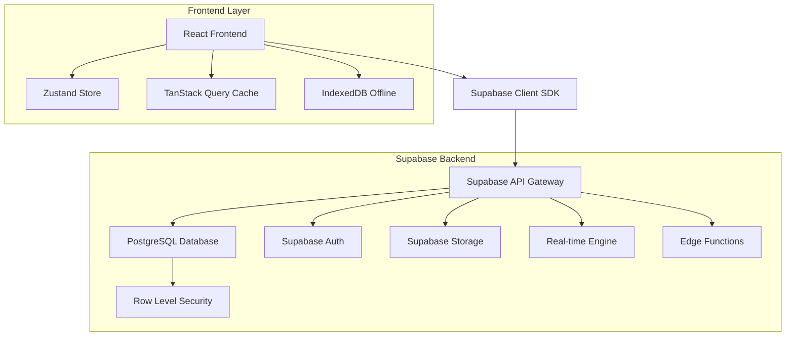
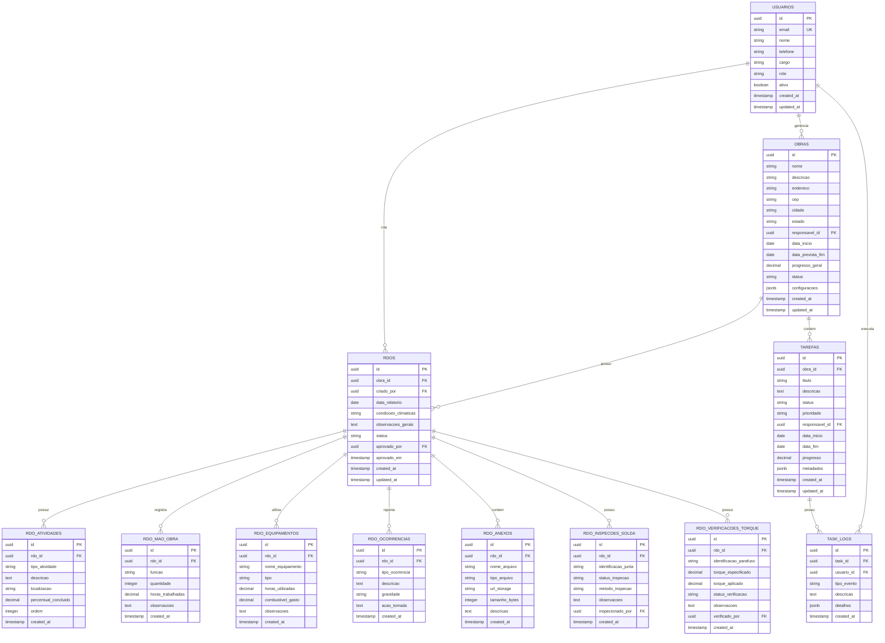

# Arquitetura Completa de Banco de Dados - RDO Mobile App

## 1. Visão Geral da Arquitetura de Dados

### 1.1 Estratégia de Banco de Dados

O sistema RDO Mobile utiliza **Supabase** como solução Backend-as-a-Service (BaaS), fornecendo:
- **PostgreSQL** como banco de dados principal
- **Autenticação** integrada com Row Level Security (RLS)
- **Storage** para arquivos e imagens
- **Real-time subscriptions** para sincronização em tempo real
- **Edge Functions** para lógica de negócio complexa

### 1.2 Arquitetura de Conexão



## 2. Modelo de Dados Completo

### 2.1 Diagrama Entidade-Relacionamento



## 3. Scripts de Criação do Banco de Dados

### 3.1 Tabelas Principais

```sql
-- Habilitar extensões necessárias
CREATE EXTENSION IF NOT EXISTS "uuid-ossp";
CREATE EXTENSION IF NOT EXISTS "pg_trgm";

-- Tabela de Usuários
CREATE TABLE usuarios (
    id UUID PRIMARY KEY DEFAULT gen_random_uuid(),
    email VARCHAR(255) UNIQUE NOT NULL,
    nome VARCHAR(100) NOT NULL,
    telefone VARCHAR(20),
    cargo VARCHAR(50),
    role VARCHAR(20) DEFAULT 'usuario' CHECK (role IN ('admin', 'engenheiro', 'mestre_obra', 'usuario')),
    ativo BOOLEAN DEFAULT true,
    created_at TIMESTAMP WITH TIME ZONE DEFAULT NOW(),
    updated_at TIMESTAMP WITH TIME ZONE DEFAULT NOW()
);

-- Tabela de Obras
CREATE TABLE obras (
    id UUID PRIMARY KEY DEFAULT gen_random_uuid(),
    nome VARCHAR(200) NOT NULL,
    descricao TEXT,
    endereco TEXT,
    cep VARCHAR(10),
    cidade VARCHAR(100),
    estado VARCHAR(2),
    responsavel_id UUID REFERENCES usuarios(id),
    data_inicio DATE,
    data_prevista_fim DATE,
    progresso_geral DECIMAL(5,2) DEFAULT 0.00,
    status VARCHAR(20) DEFAULT 'ativa' CHECK (status IN ('ativa', 'pausada', 'concluida', 'cancelada')),
    configuracoes JSONB DEFAULT '{}',
    created_at TIMESTAMP WITH TIME ZONE DEFAULT NOW(),
    updated_at TIMESTAMP WITH TIME ZONE DEFAULT NOW()
);

-- Tabela de RDOs
CREATE TABLE rdos (
    id UUID PRIMARY KEY DEFAULT gen_random_uuid(),
    obra_id UUID NOT NULL REFERENCES obras(id) ON DELETE CASCADE,
    criado_por UUID NOT NULL REFERENCES usuarios(id),
    data_relatorio DATE NOT NULL,
    condicoes_climaticas VARCHAR(50) NOT NULL,
    observacoes_gerais TEXT,
    status VARCHAR(20) DEFAULT 'rascunho' CHECK (status IN ('rascunho', 'enviado', 'aprovado', 'rejeitado')),
    aprovado_por UUID REFERENCES usuarios(id),
    aprovado_em TIMESTAMP WITH TIME ZONE,
    created_at TIMESTAMP WITH TIME ZONE DEFAULT NOW(),
    updated_at TIMESTAMP WITH TIME ZONE DEFAULT NOW(),
    UNIQUE(obra_id, data_relatorio)
);

-- Tabela de Atividades do RDO
CREATE TABLE rdo_atividades (
    id UUID PRIMARY KEY DEFAULT gen_random_uuid(),
    rdo_id UUID NOT NULL REFERENCES rdos(id) ON DELETE CASCADE,
    tipo_atividade VARCHAR(100) NOT NULL,
    descricao TEXT NOT NULL,
    localizacao VARCHAR(200),
    percentual_concluido DECIMAL(5,2) DEFAULT 0.00,
    ordem INTEGER DEFAULT 1,
    created_at TIMESTAMP WITH TIME ZONE DEFAULT NOW()
);

-- Tabela de Mão de Obra do RDO
CREATE TABLE rdo_mao_obra (
    id UUID PRIMARY KEY DEFAULT gen_random_uuid(),
    rdo_id UUID NOT NULL REFERENCES rdos(id) ON DELETE CASCADE,
    funcao VARCHAR(100) NOT NULL,
    quantidade INTEGER NOT NULL DEFAULT 1,
    horas_trabalhadas DECIMAL(4,2) NOT NULL DEFAULT 8.00,
    observacoes TEXT,
    created_at TIMESTAMP WITH TIME ZONE DEFAULT NOW()
);

-- Tabela de Equipamentos do RDO
CREATE TABLE rdo_equipamentos (
    id UUID PRIMARY KEY DEFAULT gen_random_uuid(),
    rdo_id UUID NOT NULL REFERENCES rdos(id) ON DELETE CASCADE,
    nome_equipamento VARCHAR(100) NOT NULL,
    tipo VARCHAR(50),
    horas_utilizadas DECIMAL(4,2) DEFAULT 0.00,
    combustivel_gasto DECIMAL(6,2) DEFAULT 0.00,
    observacoes TEXT,
    created_at TIMESTAMP WITH TIME ZONE DEFAULT NOW()
);

-- Tabela de Ocorrências do RDO
CREATE TABLE rdo_ocorrencias (
    id UUID PRIMARY KEY DEFAULT gen_random_uuid(),
    rdo_id UUID NOT NULL REFERENCES rdos(id) ON DELETE CASCADE,
    tipo_ocorrencia VARCHAR(100) NOT NULL,
    descricao TEXT NOT NULL,
    gravidade VARCHAR(20) DEFAULT 'baixa' CHECK (gravidade IN ('baixa', 'media', 'alta', 'critica')),
    acao_tomada TEXT,
    created_at TIMESTAMP WITH TIME ZONE DEFAULT NOW()
);

-- Tabela de Anexos do RDO
CREATE TABLE rdo_anexos (
    id UUID PRIMARY KEY DEFAULT gen_random_uuid(),
    rdo_id UUID NOT NULL REFERENCES rdos(id) ON DELETE CASCADE,
    nome_arquivo VARCHAR(255) NOT NULL,
    tipo_arquivo VARCHAR(50),
    url_storage TEXT NOT NULL,
    tamanho_bytes INTEGER,
    descricao TEXT,
    created_at TIMESTAMP WITH TIME ZONE DEFAULT NOW()
);

-- Tabela de Inspeções de Solda
CREATE TABLE rdo_inspecoes_solda (
    id UUID PRIMARY KEY DEFAULT gen_random_uuid(),
    rdo_id UUID NOT NULL REFERENCES rdos(id) ON DELETE CASCADE,
    identificacao_junta VARCHAR(100) NOT NULL,
    status_inspecao VARCHAR(20) DEFAULT 'pendente' CHECK (status_inspecao IN ('aprovado', 'reprovado', 'pendente')),
    metodo_inspecao VARCHAR(50),
    observacoes TEXT,
    inspecionado_por UUID REFERENCES usuarios(id),
    created_at TIMESTAMP WITH TIME ZONE DEFAULT NOW()
);

-- Tabela de Verificações de Torque
CREATE TABLE rdo_verificacoes_torque (
    id UUID PRIMARY KEY DEFAULT gen_random_uuid(),
    rdo_id UUID NOT NULL REFERENCES rdos(id) ON DELETE CASCADE,
    identificacao_parafuso VARCHAR(100) NOT NULL,
    torque_especificado DECIMAL(6,2),
    torque_aplicado DECIMAL(6,2) NOT NULL,
    status_verificacao VARCHAR(20) DEFAULT 'conforme' CHECK (status_verificacao IN ('conforme', 'nao_conforme')),
    observacoes TEXT,
    verificado_por UUID REFERENCES usuarios(id),
    created_at TIMESTAMP WITH TIME ZONE DEFAULT NOW()
);

-- Tabela de Tarefas
CREATE TABLE tarefas (
    id UUID PRIMARY KEY DEFAULT gen_random_uuid(),
    obra_id UUID NOT NULL REFERENCES obras(id) ON DELETE CASCADE,
    titulo VARCHAR(200) NOT NULL,
    descricao TEXT,
    status VARCHAR(20) DEFAULT 'pendente' CHECK (status IN ('pendente', 'em_andamento', 'concluida', 'cancelada')),
    prioridade VARCHAR(20) DEFAULT 'media' CHECK (prioridade IN ('baixa', 'media', 'alta', 'urgente')),
    responsavel_id UUID REFERENCES usuarios(id),
    data_inicio DATE,
    data_fim DATE,
    progresso DECIMAL(5,2) DEFAULT 0.00,
    metadados JSONB DEFAULT '{}',
    created_at TIMESTAMP WITH TIME ZONE DEFAULT NOW(),
    updated_at TIMESTAMP WITH TIME ZONE DEFAULT NOW()
);

-- Tabela de Logs de Tarefas
CREATE TABLE task_logs (
    id UUID PRIMARY KEY DEFAULT gen_random_uuid(),
    task_id UUID NOT NULL REFERENCES tarefas(id) ON DELETE CASCADE,
    usuario_id UUID NOT NULL REFERENCES usuarios(id),
    tipo_evento VARCHAR(20) NOT NULL CHECK (tipo_evento IN ('inicio', 'pausa', 'retomada', 'conclusao', 'revisao', 'edicao', 'cancelamento')),
    descricao TEXT,
    detalhes JSONB DEFAULT '{}',
    created_at TIMESTAMP WITH TIME ZONE DEFAULT NOW()
);
```

### 3.2 Índices para Performance

```sql
-- Índices para otimização de consultas
CREATE INDEX idx_usuarios_email ON usuarios(email);
CREATE INDEX idx_usuarios_role ON usuarios(role);
CREATE INDEX idx_usuarios_ativo ON usuarios(ativo);

CREATE INDEX idx_obras_responsavel ON obras(responsavel_id);
CREATE INDEX idx_obras_status ON obras(status);
CREATE INDEX idx_obras_data_inicio ON obras(data_inicio);

CREATE INDEX idx_rdos_obra_data ON rdos(obra_id, data_relatorio);
CREATE INDEX idx_rdos_criado_por ON rdos(criado_por);
CREATE INDEX idx_rdos_status ON rdos(status);
CREATE INDEX idx_rdos_data_relatorio ON rdos(data_relatorio DESC);

CREATE INDEX idx_rdo_atividades_rdo ON rdo_atividades(rdo_id);
CREATE INDEX idx_rdo_mao_obra_rdo ON rdo_mao_obra(rdo_id);
CREATE INDEX idx_rdo_equipamentos_rdo ON rdo_equipamentos(rdo_id);
CREATE INDEX idx_rdo_ocorrencias_rdo ON rdo_ocorrencias(rdo_id);
CREATE INDEX idx_rdo_anexos_rdo ON rdo_anexos(rdo_id);

CREATE INDEX idx_tarefas_obra ON tarefas(obra_id);
CREATE INDEX idx_tarefas_responsavel ON tarefas(responsavel_id);
CREATE INDEX idx_tarefas_status ON tarefas(status);
CREATE INDEX idx_tarefas_data_fim ON tarefas(data_fim);

CREATE INDEX idx_task_logs_task ON task_logs(task_id);
CREATE INDEX idx_task_logs_usuario ON task_logs(usuario_id);
CREATE INDEX idx_task_logs_created_at ON task_logs(created_at DESC);

-- Índices para busca textual
CREATE INDEX idx_obras_nome_trgm ON obras USING gin(nome gin_trgm_ops);
CREATE INDEX idx_rdos_observacoes_trgm ON rdos USING gin(observacoes_gerais gin_trgm_ops);
```

### 3.3 Triggers para Auditoria

```sql
-- Função para atualizar timestamp
CREATE OR REPLACE FUNCTION update_updated_at_column()
RETURNS TRIGGER AS $$
BEGIN
    NEW.updated_at = NOW();
    RETURN NEW;
END;
$$ language 'plpgsql';

-- Triggers para updated_at
CREATE TRIGGER update_usuarios_updated_at BEFORE UPDATE ON usuarios FOR EACH ROW EXECUTE FUNCTION update_updated_at_column();
CREATE TRIGGER update_obras_updated_at BEFORE UPDATE ON obras FOR EACH ROW EXECUTE FUNCTION update_updated_at_column();
CREATE TRIGGER update_rdos_updated_at BEFORE UPDATE ON rdos FOR EACH ROW EXECUTE FUNCTION update_updated_at_column();
CREATE TRIGGER update_tarefas_updated_at BEFORE UPDATE ON tarefas FOR EACH ROW EXECUTE FUNCTION update_updated_at_column();
```

## 4. Row Level Security (RLS)

### 4.1 Políticas de Segurança

```sql
-- Habilitar RLS em todas as tabelas
ALTER TABLE usuarios ENABLE ROW LEVEL SECURITY;
ALTER TABLE obras ENABLE ROW LEVEL SECURITY;
ALTER TABLE rdos ENABLE ROW LEVEL SECURITY;
ALTER TABLE rdo_atividades ENABLE ROW LEVEL SECURITY;
ALTER TABLE rdo_mao_obra ENABLE ROW LEVEL SECURITY;
ALTER TABLE rdo_equipamentos ENABLE ROW LEVEL SECURITY;
ALTER TABLE rdo_ocorrencias ENABLE ROW LEVEL SECURITY;
ALTER TABLE rdo_anexos ENABLE ROW LEVEL SECURITY;
ALTER TABLE rdo_inspecoes_solda ENABLE ROW LEVEL SECURITY;
ALTER TABLE rdo_verificacoes_torque ENABLE ROW LEVEL SECURITY;
ALTER TABLE tarefas ENABLE ROW LEVEL SECURITY;
ALTER TABLE task_logs ENABLE ROW LEVEL SECURITY;

-- Políticas para usuários
CREATE POLICY "Usuários podem ver próprio perfil" ON usuarios FOR SELECT USING (auth.uid() = id);
CREATE POLICY "Usuários podem atualizar próprio perfil" ON usuarios FOR UPDATE USING (auth.uid() = id);
CREATE POLICY "Admins podem gerenciar usuários" ON usuarios FOR ALL USING (auth.jwt() ->> 'role' = 'admin');

-- Políticas para obras
CREATE POLICY "Usuários podem ver obras onde participam" ON obras FOR SELECT USING (
    auth.uid() = responsavel_id OR 
    auth.jwt() ->> 'role' IN ('admin', 'engenheiro')
);

CREATE POLICY "Engenheiros e admins podem criar obras" ON obras FOR INSERT WITH CHECK (
    auth.jwt() ->> 'role' IN ('admin', 'engenheiro')
);

CREATE POLICY "Responsáveis podem atualizar suas obras" ON obras FOR UPDATE USING (
    auth.uid() = responsavel_id OR 
    auth.jwt() ->> 'role' IN ('admin', 'engenheiro')
);

-- Políticas para RDOs
CREATE POLICY "Usuários podem ver RDOs de suas obras" ON rdos FOR SELECT USING (
    EXISTS (
        SELECT 1 FROM obras 
        WHERE obras.id = rdos.obra_id 
        AND (obras.responsavel_id = auth.uid() OR auth.jwt() ->> 'role' IN ('admin', 'engenheiro'))
    )
);

CREATE POLICY "Usuários podem criar RDOs" ON rdos FOR INSERT WITH CHECK (
    auth.uid() = criado_por AND
    EXISTS (
        SELECT 1 FROM obras 
        WHERE obras.id = obra_id 
        AND (obras.responsavel_id = auth.uid() OR auth.jwt() ->> 'role' IN ('admin', 'engenheiro', 'mestre_obra'))
    )
);

CREATE POLICY "Criadores podem atualizar próprios RDOs" ON rdos FOR UPDATE USING (
    auth.uid() = criado_por AND status = 'rascunho'
);

-- Políticas para tabelas relacionadas ao RDO
CREATE POLICY "Acesso baseado no RDO" ON rdo_atividades FOR ALL USING (
    EXISTS (
        SELECT 1 FROM rdos 
        WHERE rdos.id = rdo_atividades.rdo_id 
        AND (rdos.criado_por = auth.uid() OR auth.jwt() ->> 'role' IN ('admin', 'engenheiro'))
    )
);

-- Aplicar política similar para todas as tabelas rdo_*
CREATE POLICY "Acesso baseado no RDO" ON rdo_mao_obra FOR ALL USING (
    EXISTS (SELECT 1 FROM rdos WHERE rdos.id = rdo_mao_obra.rdo_id AND (rdos.criado_por = auth.uid() OR auth.jwt() ->> 'role' IN ('admin', 'engenheiro')))
);

CREATE POLICY "Acesso baseado no RDO" ON rdo_equipamentos FOR ALL USING (
    EXISTS (SELECT 1 FROM rdos WHERE rdos.id = rdo_equipamentos.rdo_id AND (rdos.criado_por = auth.uid() OR auth.jwt() ->> 'role' IN ('admin', 'engenheiro')))
);

CREATE POLICY "Acesso baseado no RDO" ON rdo_ocorrencias FOR ALL USING (
    EXISTS (SELECT 1 FROM rdos WHERE rdos.id = rdo_ocorrencias.rdo_id AND (rdos.criado_por = auth.uid() OR auth.jwt() ->> 'role' IN ('admin', 'engenheiro')))
);

CREATE POLICY "Acesso baseado no RDO" ON rdo_anexos FOR ALL USING (
    EXISTS (SELECT 1 FROM rdos WHERE rdos.id = rdo_anexos.rdo_id AND (rdos.criado_por = auth.uid() OR auth.jwt() ->> 'role' IN ('admin', 'engenheiro')))
);

CREATE POLICY "Acesso baseado no RDO" ON rdo_inspecoes_solda FOR ALL USING (
    EXISTS (SELECT 1 FROM rdos WHERE rdos.id = rdo_inspecoes_solda.rdo_id AND (rdos.criado_por = auth.uid() OR auth.jwt() ->> 'role' IN ('admin', 'engenheiro')))
);

CREATE POLICY "Acesso baseado no RDO" ON rdo_verificacoes_torque FOR ALL USING (
    EXISTS (SELECT 1 FROM rdos WHERE rdos.id = rdo_verificacoes_torque.rdo_id AND (rdos.criado_por = auth.uid() OR auth.jwt() ->> 'role' IN ('admin', 'engenheiro')))
);

-- Políticas para tarefas
CREATE POLICY "Usuários podem ver tarefas de suas obras" ON tarefas FOR SELECT USING (
    EXISTS (
        SELECT 1 FROM obras 
        WHERE obras.id = tarefas.obra_id 
        AND (obras.responsavel_id = auth.uid() OR auth.jwt() ->> 'role' IN ('admin', 'engenheiro'))
    ) OR responsavel_id = auth.uid()
);

CREATE POLICY "Usuários podem criar tarefas" ON tarefas FOR INSERT WITH CHECK (
    EXISTS (
        SELECT 1 FROM obras 
        WHERE obras.id = obra_id 
        AND (obras.responsavel_id = auth.uid() OR auth.jwt() ->> 'role' IN ('admin', 'engenheiro', 'mestre_obra'))
    )
);

-- Políticas para task_logs
CREATE POLICY "Usuários podem ver logs de suas tarefas" ON task_logs FOR SELECT USING (
    EXISTS (
        SELECT 1 FROM tarefas 
        WHERE tarefas.id = task_logs.task_id 
        AND (tarefas.responsavel_id = auth.uid() OR auth.jwt() ->> 'role' IN ('admin', 'engenheiro'))
    )
);

CREATE POLICY "Usuários podem criar logs" ON task_logs FOR INSERT WITH CHECK (
    auth.uid() = usuario_id
);
```

## 5. Configuração do Cliente Supabase

### 5.1 Configuração Básica

```typescript
// src/lib/supabase.ts
import { createClient } from '@supabase/supabase-js'
import { Database } from './database.types'

const supabaseUrl = import.meta.env.VITE_SUPABASE_URL
const supabaseAnonKey = import.meta.env.VITE_SUPABASE_ANON_KEY

export const supabase = createClient<Database>(supabaseUrl, supabaseAnonKey, {
  auth: {
    autoRefreshToken: true,
    persistSession: true,
    detectSessionInUrl: true
  },
  realtime: {
    params: {
      eventsPerSecond: 10
    }
  }
})

// Tipos TypeScript gerados automaticamente
export type Tables<T extends keyof Database['public']['Tables']> = Database['public']['Tables'][T]['Row']
export type Enums<T extends keyof Database['public']['Enums']> = Database['public']['Enums'][T]
```

### 5.2 Hooks Customizados para Dados

```typescript
// src/hooks/useRDOs.ts
import { useQuery, useMutation, useQueryClient } from '@tanstack/react-query'
import { supabase } from '../lib/supabase'
import { Tables } from '../lib/supabase'

type RDO = Tables<'rdos'>
type RDOWithDetails = RDO & {
  atividades: Tables<'rdo_atividades'>[]
  mao_obra: Tables<'rdo_mao_obra'>[]
  equipamentos: Tables<'rdo_equipamentos'>[]
  ocorrencias: Tables<'rdo_ocorrencias'>[]
  anexos: Tables<'rdo_anexos'>[]
}

export function useRDOs(obraId: string) {
  return useQuery({
    queryKey: ['rdos', obraId],
    queryFn: async () => {
      const { data, error } = await supabase
        .from('rdos')
        .select(`
          *,
          atividades:rdo_atividades(*),
          mao_obra:rdo_mao_obra(*),
          equipamentos:rdo_equipamentos(*),
          ocorrencias:rdo_ocorrencias(*),
          anexos:rdo_anexos(*)
        `)
        .eq('obra_id', obraId)
        .order('data_relatorio', { ascending: false })
      
      if (error) throw error
      return data as RDOWithDetails[]
    }
  })
}

export function useCreateRDO() {
  const queryClient = useQueryClient()
  
  return useMutation({
    mutationFn: async (rdoData: Partial<RDO> & {
      atividades?: Partial<Tables<'rdo_atividades'>>[]
      mao_obra?: Partial<Tables<'rdo_mao_obra'>>[]
      equipamentos?: Partial<Tables<'rdo_equipamentos'>>[]
      ocorrencias?: Partial<Tables<'rdo_ocorrencias'>>[]
    }) => {
      const { atividades, mao_obra, equipamentos, ocorrencias, ...rdo } = rdoData
      
      // Criar RDO principal
      const { data: rdoCreated, error: rdoError } = await supabase
        .from('rdos')
        .insert(rdo)
        .select()
        .single()
      
      if (rdoError) throw rdoError
      
      // Inserir dados relacionados
      if (atividades?.length) {
        const { error } = await supabase
          .from('rdo_atividades')
          .insert(atividades.map(a => ({ ...a, rdo_id: rdoCreated.id })))
        if (error) throw error
      }
      
      if (mao_obra?.length) {
        const { error } = await supabase
          .from('rdo_mao_obra')
          .insert(mao_obra.map(m => ({ ...m, rdo_id: rdoCreated.id })))
        if (error) throw error
      }
      
      if (equipamentos?.length) {
        const { error } = await supabase
          .from('rdo_equipamentos')
          .insert(equipamentos.map(e => ({ ...e, rdo_id: rdoCreated.id })))
        if (error) throw error
      }
      
      if (ocorrencias?.length) {
        const { error } = await supabase
          .from('rdo_ocorrencias')
          .insert(ocorrencias.map(o => ({ ...o, rdo_id: rdoCreated.id })))
        if (error) throw error
      }
      
      return rdoCreated
    },
    onSuccess: (data) => {
      queryClient.invalidateQueries({ queryKey: ['rdos', data.obra_id] })
    }
  })
}
```

### 5.3 Store Zustand Integrado

```typescript
// src/stores/rdoStore.ts
import { create } from 'zustand'
import { persist } from 'zustand/middleware'
import { supabase } from '../lib/supabase'
import { Tables } from '../lib/supabase'

type RDO = Tables<'rdos'>
type Obra = Tables<'obras'>

interface RDOState {
  // Estado
  currentObra: Obra | null
  rdos: RDO[]
  loading: boolean
  error: string | null
  
  // Ações
  setCurrentObra: (obra: Obra) => void
  loadRDOs: (obraId: string) => Promise<void>
  createRDO: (rdoData: Partial<RDO>) => Promise<RDO>
  updateRDO: (id: string, updates: Partial<RDO>) => Promise<void>
  deleteRDO: (id: string) => Promise<void>
  
  // Real-time
  subscribeToRDOs: (obraId: string) => () => void
}

export const useRDOStore = create<RDOState>()(persist(
  (set, get) => ({
    // Estado inicial
    currentObra: null,
    rdos: [],
    loading: false,
    error: null,
    
    // Ações
    setCurrentObra: (obra) => set({ currentObra: obra }),
    
    loadRDOs: async (obraId) => {
      set({ loading: true, error: null })
      try {
        const { data, error } = await supabase
          .from('rdos')
          .select('*')
          .eq('obra_id', obraId)
          .order('data_relatorio', { ascending: false })
        
        if (error) throw error
        set({ rdos: data, loading: false })
      } catch (error) {
        set({ error: (error as Error).message, loading: false })
      }
    },
    
    createRDO: async (rdoData) => {
      set({ loading: true, error: null })
      try {
        const { data, error } = await supabase
          .from('rdos')
          .insert(rdoData)
          .select()
          .single()
        
        if (error) throw error
        
        set(state => ({ 
          rdos: [data, ...state.rdos], 
          loading: false 
        }))
        
        return data
      } catch (error) {
        set({ error: (error as Error).message, loading: false })
        throw error
      }
    },
    
    updateRDO: async (id, updates) => {
      set({ loading: true, error: null })
      try {
        const { error } = await supabase
          .from('rdos')
          .update(updates)
          .eq('id', id)
        
        if (error) throw error
        
        set(state => ({
          rdos: state.rdos.map(rdo => 
            rdo.id === id ? { ...rdo, ...updates } : rdo
          ),
          loading: false
        }))
      } catch (error) {
        set({ error: (error as Error).message, loading: false })
      }
    },
    
    deleteRDO: async (id) => {
      set({ loading: true, error: null })
      try {
        const { error } = await supabase
          .from('rdos')
          .delete()
          .eq('id', id)
        
        if (error) throw error
        
        set(state => ({
          rdos: state.rdos.filter(rdo => rdo.id !== id),
          loading: false
        }))
      } catch (error) {
        set({ error: (error as Error).message, loading: false })
      }
    },
    
    subscribeToRDOs: (obraId) => {
      const subscription = supabase
        .channel(`rdos-${obraId}`)
        .on(
          'postgres_changes',
          {
            event: '*',
            schema: 'public',
            table: 'rdos',
            filter: `obra_id=eq.${obraId}`
          },
          (payload) => {
            const { eventType, new: newRecord, old: oldRecord } = payload
            
            set(state => {
              switch (eventType) {
                case 'INSERT':
                  return { rdos: [newRecord as RDO, ...state.rdos] }
                case 'UPDATE':
                  return {
                    rdos: state.rdos.map(rdo => 
                      rdo.id === newRecord.id ? newRecord as RDO : rdo
                    )
                  }
                case 'DELETE':
                  return {
                    rdos: state.rdos.filter(rdo => rdo.id !== oldRecord.id)
                  }
                default:
                  return state
              }
            })
          }
        )
        .subscribe()
      
      return () => subscription.unsubscribe()
    }
  }),
  {
    name: 'rdo-store',
    partialize: (state) => ({ currentObra: state.currentObra })
  }
))
```

## 6. Estratégias de Cache e Offline

### 6.1 Configuração do TanStack Query

```typescript
// src/lib/queryClient.ts
import { QueryClient } from '@tanstack/react-query'
import { persistQueryClient } from '@tanstack/react-query-persist-client-core'
import { createSyncStoragePersister } from '@tanstack/query-sync-storage-persister'

const queryClient = new QueryClient({
  defaultOptions: {
    queries: {
      staleTime: 5 * 60 * 1000, // 5 minutos
      gcTime: 10 * 60 * 1000, // 10 minutos
      retry: 3,
      refetchOnWindowFocus: false,
      refetchOnReconnect: true
    },
    mutations: {
      retry: 1
    }
  }
})

// Persistir cache no localStorage
const localStoragePersister = createSyncStoragePersister({
  storage: window.localStorage,
  key: 'rdo-cache'
})

persistQueryClient({
  queryClient,
  persister: localStoragePersister,
  maxAge: 24 * 60 * 60 * 1000 // 24 horas
})

export { queryClient }
```

### 6.2 Service Worker para Offline

```typescript
// src/sw.ts
import { precacheAndRoute, cleanupOutdatedCaches } from 'workbox-precaching'
import { registerRoute } from 'workbox-routing'
import { StaleWhileRevalidate, CacheFirst } from 'workbox-strategies'

// Precache de arquivos estáticos
precacheAndRoute(self.__WB_MANIFEST)
cleanupOutdatedCaches()

// Cache de API calls
registerRoute(
  ({ url }) => url.origin === 'https://your-supabase-url.supabase.co',
  new StaleWhileRevalidate({
    cacheName: 'supabase-api',
    plugins: [
      {
        cacheKeyWillBeUsed: async ({ request }) => {
          return `${request.url}?${Date.now()}`
        }
      }
    ]
  })
)

// Cache de imagens
registerRoute(
  ({ request }) => request.destination === 'image',
  new CacheFirst({
    cacheName: 'images',
    plugins: [
      {
        cacheExpiration: {
          maxEntries: 100,
          maxAgeSeconds: 30 * 24 * 60 * 60 // 30 dias
        }
      }
    ]
  })
)
```

## 7. Monitoramento e Analytics

### 7.1 Métricas de Performance

```sql
-- Views para relatórios e analytics
CREATE VIEW vw_obras_dashboard AS
SELECT 
    o.id,
    o.nome,
    o.status,
    o.progresso_geral,
    COUNT(r.id) as total_rdos,
    COUNT(CASE WHEN r.status = 'aprovado' THEN 1 END) as rdos_aprovados,
    COUNT(t.id) as total_tarefas,
    COUNT(CASE WHEN t.status = 'concluida' THEN 1 END) as tarefas_concluidas,
    AVG(CASE WHEN t.status = 'concluida' THEN t.progresso END) as progresso_medio_tarefas
FROM obras o
LEFT JOIN rdos r ON o.id = r.obra_id
LEFT JOIN tarefas t ON o.id = t.obra_id
GROUP BY o.id, o.nome, o.status, o.progresso_geral;

CREATE VIEW vw_produtividade_mensal AS
SELECT 
    DATE_TRUNC('month', r.data_relatorio) as mes,
    o.nome as obra,
    COUNT(r.id) as rdos_criados,
    COUNT(ra.id) as atividades_executadas,
    SUM(rm.quantidade * rm.horas_trabalhadas) as total_horas_trabalhadas
FROM rdos r
JOIN obras o ON r.obra_id = o.id
LEFT JOIN rdo_atividades ra ON r.id = ra.rdo_id
LEFT JOIN rdo_mao_obra rm ON r.id = rm.rdo_id
GROUP BY DATE_TRUNC('month', r.data_relatorio), o.nome
ORDER BY mes DESC;
```

### 7.2 Logs de Auditoria

```sql
-- Tabela de auditoria
CREATE TABLE audit_logs (
    id UUID PRIMARY KEY DEFAULT gen_random_uuid(),
    table_name VARCHAR(50) NOT NULL,
    record_id UUID NOT NULL,
    action VARCHAR(10) NOT NULL CHECK (action IN ('INSERT', 'UPDATE', 'DELETE')),
    old_values JSONB,
    new_values JSONB,
    user_id UUID REFERENCES usuarios(id),
    timestamp TIMESTAMP WITH TIME ZONE DEFAULT NOW()
);

-- Função de auditoria
CREATE OR REPLACE FUNCTION audit_trigger_function()
RETURNS TRIGGER AS $$
BEGIN
    IF TG_OP = 'DELETE' THEN
        INSERT INTO audit_logs (table_name, record_id, action, old_values, user_id)
        VALUES (TG_TABLE_NAME, OLD.id, TG_OP, row_to_json(OLD), auth.uid());
        RETURN OLD;
    ELSIF TG_OP = 'UPDATE' THEN
        INSERT INTO audit_logs (table_name, record_id, action, old_values, new_values, user_id)
        VALUES (TG_TABLE_NAME, NEW.id, TG_OP, row_to_json(OLD), row_to_json(NEW), auth.uid());
        RETURN NEW;
    ELSIF TG_OP = 'INSERT' THEN
        INSERT INTO audit_logs (table_name, record_id, action, new_values, user_id)
        VALUES (TG_TABLE_NAME, NEW.id, TG_OP, row_to_json(NEW), auth.uid());
        RETURN NEW;
    END IF;
    RETURN NULL;
END;
$$ LANGUAGE plpgsql;

-- Aplicar triggers de auditoria
CREATE TRIGGER audit_rdos AFTER INSERT OR UPDATE OR DELETE ON rdos FOR EACH ROW EXECUTE FUNCTION audit_trigger_function();
CREATE TRIGGER audit_obras AFTER INSERT OR UPDATE OR DELETE ON obras FOR EACH ROW EXECUTE FUNCTION audit_trigger_function();
```

## 8. Backup e Recuperação

### 8.1 Estratégia de Backup

```sql
-- Função para backup incremental
CREATE OR REPLACE FUNCTION create_incremental_backup()
RETURNS TABLE(table_name TEXT, records_count BIGINT) AS $$
DECLARE
    backup_timestamp TIMESTAMP := NOW();
BEGIN
    -- Criar tabela de controle de backup se não existir
    CREATE TABLE IF NOT EXISTS backup_control (
        id SERIAL PRIMARY KEY,
        table_name VARCHAR(50),
        last_backup TIMESTAMP,
        created_at TIMESTAMP DEFAULT NOW()
    );
    
    -- Backup das tabelas principais
    RETURN QUERY
    SELECT 'rdos'::TEXT, COUNT(*) FROM rdos WHERE updated_at > COALESCE(
        (SELECT last_backup FROM backup_control WHERE table_name = 'rdos'), 
        '1970-01-01'::TIMESTAMP
    );
    
    -- Atualizar controle de backup
    INSERT INTO backup_control (table_name, last_backup) 
    VALUES ('rdos', backup_timestamp)
    ON CONFLICT (table_name) DO UPDATE SET last_backup = backup_timestamp;
END;
$$ LANGUAGE plpgsql;
```

## 9. Configurações de Ambiente

### 9.1 Variáveis de Ambiente

```bash
# .env.local
VITE_SUPABASE_URL=https://your-project.supabase.co
VITE_SUPABASE_ANON_KEY=your-anon-key
VITE_SUPABASE_SERVICE_ROLE_KEY=your-service-role-key

# Configurações de cache
VITE_CACHE_TTL=300000
VITE_OFFLINE_ENABLED=true

# Configurações de upload
VITE_MAX_FILE_SIZE=10485760
VITE_ALLOWED_FILE_TYPES=image/*,application/pdf
```

### 9.2 Configuração de Produção

```typescript
// src/config/database.ts
export const databaseConfig = {
  development: {
    supabaseUrl: import.meta.env.VITE_SUPABASE_URL,
    supabaseKey: import.meta.env.VITE_SUPABASE_ANON_KEY,
    enableRealtime: true,
    enableCache: true,
    cacheTimeout: 5 * 60 * 1000
  },
  production: {
    supabaseUrl: import.meta.env.VITE_SUPABASE_URL,
    supabaseKey: import.meta.env.VITE_SUPABASE_ANON_KEY,
    enableRealtime: true,
    enableCache: true,
    cacheTimeout: 10 * 60 * 1000,
    enableCompression: true,
    maxRetries: 3
  }
}

export const getCurrentConfig = () => {
  const env = import.meta.env.MODE
  return databaseConfig[env as keyof typeof databaseConfig] || databaseConfig.development
}
```

Esta documentação fornece uma base sólida para implementar uma conexão completa com banco de dados no projeto RDO Mobile, incluindo esquema de dados, segurança, performance e estratégias offline.