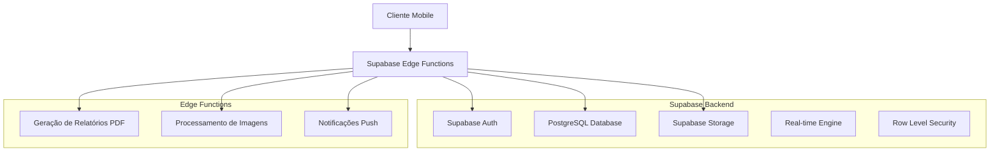
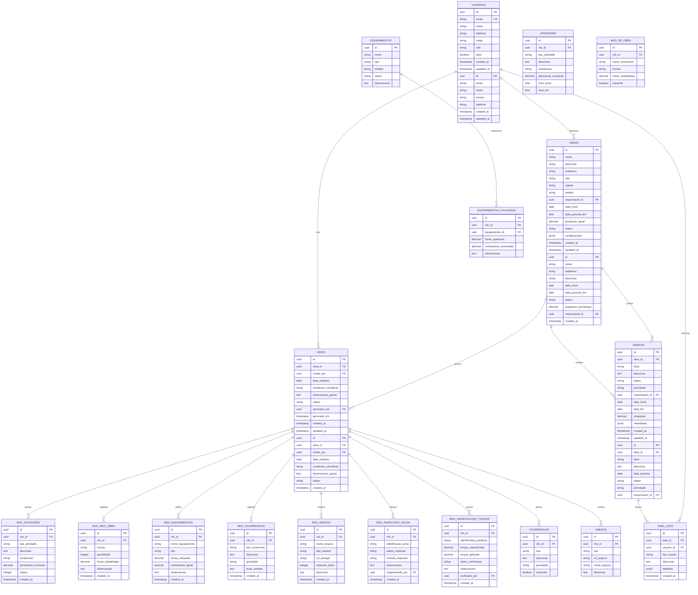

# Documento de Arquitetura Técnica - RDO Mobile App

## 1. Design da Arquitetura

```mermaid
graph TD
    A[Usuário Mobile] --> B[React Native/PWA Frontend]
    B --> C[Supabase SDK]
    C --> D[Supabase Backend]
    
    subgraph "Frontend Layer"
        B
        E[Zustand State Management]
        F[React Hook Form]
        G[Framer Motion]
        H[Tailwind CSS]
    end
    
    subgraph "Backend as a Service (Supabase)"
        D
        I[PostgreSQL Database]
        J[Authentication]
        K[Storage (Fotos/Docs)]
        L[Real-time Subscriptions]
    end
    
    subgraph "Funcionalidades Offline"
        M[IndexedDB Cache]
        N[Service Worker]
        O[Background Sync]
    end
    
    B --> M
    N --> B
    O --> C
```

## 2. Descrição das Tecnologias

* **Frontend**: React\@18 + TypeScript + Vite + Tailwind CSS

* **Mobile**: PWA (Progressive Web App) com Capacitor para recursos nativos

* **Estado**: Zustand para gerenciamento de estado global

* **Formulários**: React Hook Form + Zod para validação

* **Animações**: Framer Motion para microinterações

* **UI Components**: Headless UI + Radix UI primitives

* **Ícones**: Phosphor Icons

* **Backend**: Supabase (PostgreSQL + Auth + Storage + Real-time)

* **Cache**: TanStack Query para cache de dados

* **Offline**: Workbox para service workers

## 3. Definições de Rotas

| Rota                    | Propósito                                     |
| ----------------------- | --------------------------------------------- |
| /                       | Dashboard principal com visão geral das obras |
| /obra/:id               | Detalhes específicos de uma obra              |
| /obra/:id/rdo/novo      | Formulário para criar novo RDO                |
| /obra/:id/rdo/:rdoId    | Visualizar/editar RDO específico              |
| /obra/:id/tarefas       | Lista de tarefas da obra                      |
| /cadastros              | Menu principal de cadastros                   |
| /cadastros/obras        | Formulário de cadastro de obras               |
| /cadastros/usuarios     | Gerenciamento de usuários                     |
| /cadastros/equipamentos | Cadastro de equipamentos                      |
| <br />                  | <br />                                        |
| /cadastros/atividades   | Tipos de atividades padrão                    |
| /relatorios             | Dashboard de relatórios e exportações         |
| /perfil                 | Configurações do usuário                      |
| /configuracoes          | Configurações do aplicativo                   |

## 4. Definições de API

### 4.1 APIs Principais

**Autenticação de Usuário**

```
POST /auth/v1/token
```

Request:

| Nome do Parâmetro | Tipo   | Obrigatório | Descrição        |
| ----------------- | ------ | ----------- | ---------------- |
| email             | string | true        | Email do usuário |
| password          | string | true        | Senha do usuário |

Response:

| Nome do Parâmetro | Tipo   | Descrição                    |
| ----------------- | ------ | ---------------------------- |
| access\_token     | string | Token JWT para autenticação  |
| user              | object | Dados do usuário autenticado |

**Criar RDO**

```
POST /rest/v1/rdos
```

Request:

| Nome do Parâmetro     | Tipo   | Obrigatório | Descrição                      |
| --------------------- | ------ | ----------- | ------------------------------ |
| obra\_id              | uuid   | true        | ID da obra                     |
| data\_relatorio       | date   | true        | Data do relatório              |
| condicoes\_climaticas | string | true        | Condições do tempo             |
| atividades            | array  | true        | Lista de atividades executadas |
| mao\_de\_obra         | array  | false       | Funcionários presentes         |
| equipamentos          | array  | false       | Equipamentos utilizados        |
| ocorrencias           | array  | false       | Ocorrências registradas        |

Response:

| Nome do Parâmetro | Tipo      | Descrição           |
| ----------------- | --------- | ------------------- |
| id                | uuid      | ID do RDO criado    |
| status            | string    | Status do relatório |
| created\_at       | timestamp | Data de criação     |

Exemplo:

```json
{
  "obra_id": "123e4567-e89b-12d3-a456-426614174000",
  "data_relatorio": "2024-01-15",
  "condicoes_climaticas": "Ensolarado",
  "atividades": [
    {
      "tipo": "Concretagem",
      "descricao": "Concretagem da laje do 2º pavimento",
      "percentual_concluido": 75
    }
  ]
}
```

**Listar Obras**

```
GET /rest/v1/obras
```

Response:

| Nome do Parâmetro | Tipo   | Descrição                                |
| ----------------- | ------ | ---------------------------------------- |
| id                | uuid   | ID da obra                               |
| nome              | string | Nome da obra                             |
| endereco          | string | Endereço da obra                         |
| status            | string | Status atual (ativa, pausada, concluída) |
| progresso         | number | Percentual de conclusão                  |

## 5. Arquitetura do Servidor



## 6. Modelo de Dados

### 6.1 Definição do Modelo de Dados



### 6.2 Linguagem de Definição de Dados (DDL)

**Tabela de Usuários (usuarios)**
```sql
-- Criar tabela
CREATE TABLE usuarios (
    id UUID PRIMARY KEY DEFAULT gen_random_uuid(),
    email VARCHAR(255) UNIQUE NOT NULL,
    nome VARCHAR(100) NOT NULL,
    telefone VARCHAR(20),
    cargo VARCHAR(100),
    role VARCHAR(20) DEFAULT 'user' CHECK (role IN ('admin', 'supervisor', 'user')),
    ativo BOOLEAN DEFAULT true,
    created_at TIMESTAMP WITH TIME ZONE DEFAULT NOW(),
    updated_at TIMESTAMP WITH TIME ZONE DEFAULT NOW()
);

-- Criar índices
CREATE INDEX idx_usuarios_email ON usuarios(email);
CREATE INDEX idx_usuarios_role ON usuarios(role);
CREATE INDEX idx_usuarios_ativo ON usuarios(ativo);

-- Dados iniciais
INSERT INTO usuarios (email, nome, cargo, role) VALUES
('admin@rdo.com', 'Administrador', 'Gerente de Projeto', 'admin'),
('supervisor@rdo.com', 'Supervisor', 'Supervisor de Obra', 'supervisor'),
('user@rdo.com', 'Usuário Padrão', 'Técnico', 'user');
```

**Tabela de Obras (obras)**
```sql
CREATE TABLE obras (
    id UUID PRIMARY KEY DEFAULT gen_random_uuid(),
    nome VARCHAR(255) NOT NULL,
    descricao TEXT,
    endereco TEXT,
    cep VARCHAR(10),
    cidade VARCHAR(100),
    estado VARCHAR(2),
    responsavel_id UUID REFERENCES usuarios(id),
    data_inicio DATE,
    data_prevista_fim DATE,
    progresso_geral DECIMAL(5,2) DEFAULT 0.00,
    status VARCHAR(20) DEFAULT 'planejamento' CHECK (status IN ('planejamento', 'em_andamento', 'pausada', 'concluida', 'cancelada')),
    configuracoes JSONB DEFAULT '{}',
    created_at TIMESTAMP WITH TIME ZONE DEFAULT NOW(),
    updated_at TIMESTAMP WITH TIME ZONE DEFAULT NOW()
);

CREATE INDEX idx_obras_responsavel ON obras(responsavel_id);
CREATE INDEX idx_obras_status ON obras(status);
CREATE INDEX idx_obras_data_inicio ON obras(data_inicio);
```

**Tabela de RDOs (rdos)**
```sql
CREATE TABLE rdos (
    id UUID PRIMARY KEY DEFAULT gen_random_uuid(),
    obra_id UUID NOT NULL REFERENCES obras(id),
    criado_por UUID NOT NULL REFERENCES usuarios(id),
    data_relatorio DATE NOT NULL,
    condicoes_climaticas VARCHAR(100),
    observacoes_gerais TEXT,
    status VARCHAR(20) DEFAULT 'rascunho' CHECK (status IN ('rascunho', 'enviado', 'aprovado', 'rejeitado')),
    aprovado_por UUID REFERENCES usuarios(id),
    aprovado_em TIMESTAMP WITH TIME ZONE,
    created_at TIMESTAMP WITH TIME ZONE DEFAULT NOW(),
    updated_at TIMESTAMP WITH TIME ZONE DEFAULT NOW()
);

CREATE INDEX idx_rdos_obra ON rdos(obra_id);
CREATE INDEX idx_rdos_criado_por ON rdos(criado_por);
CREATE INDEX idx_rdos_data_relatorio ON rdos(data_relatorio);
CREATE INDEX idx_rdos_status ON rdos(status);
```

**Tabela de Atividades do RDO (rdo_atividades)**
```sql
CREATE TABLE rdo_atividades (
    id UUID PRIMARY KEY DEFAULT gen_random_uuid(),
    rdo_id UUID NOT NULL REFERENCES rdos(id) ON DELETE CASCADE,
    tipo_atividade VARCHAR(100) NOT NULL,
    descricao TEXT,
    localizacao VARCHAR(255),
    percentual_concluido DECIMAL(5,2) DEFAULT 0.00,
    ordem INTEGER DEFAULT 0,
    created_at TIMESTAMP WITH TIME ZONE DEFAULT NOW()
);

CREATE INDEX idx_rdo_atividades_rdo ON rdo_atividades(rdo_id);
CREATE INDEX idx_rdo_atividades_tipo ON rdo_atividades(tipo_atividade);
```

**Tabela de Mão de Obra (rdo_mao_obra)**
```sql
CREATE TABLE rdo_mao_obra (
    id UUID PRIMARY KEY DEFAULT gen_random_uuid(),
    rdo_id UUID NOT NULL REFERENCES rdos(id) ON DELETE CASCADE,
    funcao VARCHAR(100) NOT NULL,
    quantidade INTEGER NOT NULL DEFAULT 1,
    horas_trabalhadas DECIMAL(5,2) NOT NULL DEFAULT 0.00,
    observacoes TEXT,
    created_at TIMESTAMP WITH TIME ZONE DEFAULT NOW()
);

CREATE INDEX idx_rdo_mao_obra_rdo ON rdo_mao_obra(rdo_id);
CREATE INDEX idx_rdo_mao_obra_funcao ON rdo_mao_obra(funcao);
```

**Tabela de Equipamentos (rdo_equipamentos)**
```sql
CREATE TABLE rdo_equipamentos (
    id UUID PRIMARY KEY DEFAULT gen_random_uuid(),
    rdo_id UUID NOT NULL REFERENCES rdos(id) ON DELETE CASCADE,
    nome_equipamento VARCHAR(255) NOT NULL,
    tipo VARCHAR(100),
    horas_utilizadas DECIMAL(5,2) DEFAULT 0.00,
    combustivel_gasto DECIMAL(8,2) DEFAULT 0.00,
    observacoes TEXT,
    created_at TIMESTAMP WITH TIME ZONE DEFAULT NOW()
);

CREATE INDEX idx_rdo_equipamentos_rdo ON rdo_equipamentos(rdo_id);
CREATE INDEX idx_rdo_equipamentos_tipo ON rdo_equipamentos(tipo);
```

**Tabela de Ocorrências (rdo_ocorrencias)**
```sql
CREATE TABLE rdo_ocorrencias (
    id UUID PRIMARY KEY DEFAULT gen_random_uuid(),
    rdo_id UUID NOT NULL REFERENCES rdos(id) ON DELETE CASCADE,
    tipo_ocorrencia VARCHAR(100) NOT NULL,
    descricao TEXT NOT NULL,
    gravidade VARCHAR(20) DEFAULT 'baixa' CHECK (gravidade IN ('baixa', 'media', 'alta', 'critica')),
    acao_tomada TEXT,
    created_at TIMESTAMP WITH TIME ZONE DEFAULT NOW()
);

CREATE INDEX idx_rdo_ocorrencias_rdo ON rdo_ocorrencias(rdo_id);
CREATE INDEX idx_rdo_ocorrencias_tipo ON rdo_ocorrencias(tipo_ocorrencia);
CREATE INDEX idx_rdo_ocorrencias_gravidade ON rdo_ocorrencias(gravidade);
```

**Tabela de Anexos (rdo_anexos)**
```sql
CREATE TABLE rdo_anexos (
    id UUID PRIMARY KEY DEFAULT gen_random_uuid(),
    rdo_id UUID NOT NULL REFERENCES rdos(id) ON DELETE CASCADE,
    nome_arquivo VARCHAR(255) NOT NULL,
    tipo_arquivo VARCHAR(50),
    url_storage TEXT NOT NULL,
    tamanho_bytes INTEGER,
    descricao TEXT,
    created_at TIMESTAMP WITH TIME ZONE DEFAULT NOW()
);

CREATE INDEX idx_rdo_anexos_rdo ON rdo_anexos(rdo_id);
CREATE INDEX idx_rdo_anexos_tipo ON rdo_anexos(tipo_arquivo);
```

**Tabela de Inspeções de Solda (rdo_inspecoes_solda)**
```sql
CREATE TABLE rdo_inspecoes_solda (
    id UUID PRIMARY KEY DEFAULT gen_random_uuid(),
    rdo_id UUID NOT NULL REFERENCES rdos(id) ON DELETE CASCADE,
    identificacao_junta VARCHAR(100) NOT NULL,
    status_inspecao VARCHAR(20) DEFAULT 'pendente' CHECK (status_inspecao IN ('pendente', 'aprovada', 'rejeitada', 'retrabalho')),
    metodo_inspecao VARCHAR(100),
    observacoes TEXT,
    inspecionado_por UUID REFERENCES usuarios(id),
    created_at TIMESTAMP WITH TIME ZONE DEFAULT NOW()
);

CREATE INDEX idx_rdo_inspecoes_solda_rdo ON rdo_inspecoes_solda(rdo_id);
CREATE INDEX idx_rdo_inspecoes_solda_status ON rdo_inspecoes_solda(status_inspecao);
```

**Tabela de Verificações de Torque (rdo_verificacoes_torque)**
```sql
CREATE TABLE rdo_verificacoes_torque (
    id UUID PRIMARY KEY DEFAULT gen_random_uuid(),
    rdo_id UUID NOT NULL REFERENCES rdos(id) ON DELETE CASCADE,
    identificacao_parafuso VARCHAR(100) NOT NULL,
    torque_especificado DECIMAL(8,2) NOT NULL,
    torque_aplicado DECIMAL(8,2) NOT NULL,
    status_verificacao VARCHAR(20) DEFAULT 'conforme' CHECK (status_verificacao IN ('conforme', 'nao_conforme', 'retrabalho')),
    observacoes TEXT,
    verificado_por UUID REFERENCES usuarios(id),
    created_at TIMESTAMP WITH TIME ZONE DEFAULT NOW()
);

CREATE INDEX idx_rdo_verificacoes_torque_rdo ON rdo_verificacoes_torque(rdo_id);
CREATE INDEX idx_rdo_verificacoes_torque_status ON rdo_verificacoes_torque(status_verificacao);
```

**Tabela de Tarefas (tarefas)**
```sql
CREATE TABLE tarefas (
    id UUID PRIMARY KEY DEFAULT gen_random_uuid(),
    obra_id UUID NOT NULL REFERENCES obras(id),
    titulo VARCHAR(255) NOT NULL,
    descricao TEXT,
    status VARCHAR(20) DEFAULT 'pendente' CHECK (status IN ('pendente', 'em_andamento', 'concluida', 'cancelada')),
    prioridade VARCHAR(20) DEFAULT 'media' CHECK (prioridade IN ('baixa', 'media', 'alta', 'urgente')),
    responsavel_id UUID REFERENCES usuarios(id),
    data_inicio DATE,
    data_fim DATE,
    progresso DECIMAL(5,2) DEFAULT 0.00,
    metadados JSONB DEFAULT '{}',
    created_at TIMESTAMP WITH TIME ZONE DEFAULT NOW(),
    updated_at TIMESTAMP WITH TIME ZONE DEFAULT NOW()
);

CREATE INDEX idx_tarefas_obra ON tarefas(obra_id);
CREATE INDEX idx_tarefas_responsavel ON tarefas(responsavel_id);
CREATE INDEX idx_tarefas_status ON tarefas(status);
CREATE INDEX idx_tarefas_prioridade ON tarefas(prioridade);
```

**Tabela de Logs de Tarefas (task_logs)**
```sql
CREATE TABLE task_logs (
    id UUID PRIMARY KEY DEFAULT gen_random_uuid(),
    task_id UUID NOT NULL REFERENCES tarefas(id) ON DELETE CASCADE,
    usuario_id UUID NOT NULL REFERENCES usuarios(id),
    tipo_evento VARCHAR(50) NOT NULL,
    descricao TEXT,
    detalhes JSONB DEFAULT '{}',
    created_at TIMESTAMP WITH TIME ZONE DEFAULT NOW()
);

CREATE INDEX idx_task_logs_task ON task_logs(task_id);
CREATE INDEX idx_task_logs_usuario ON task_logs(usuario_id);
CREATE INDEX idx_task_logs_tipo ON task_logs(tipo_evento);
CREATE INDEX idx_task_logs_created_at ON task_logs(created_at DESC);
```

**Tabela de Obras**

```sql
-- Criar tabela de obras
CREATE TABLE obras (
    id UUID PRIMARY KEY DEFAULT gen_random_uuid(),
    nome VARCHAR(200) NOT NULL,
    endereco TEXT NOT NULL,
    descricao TEXT,
    data_inicio DATE NOT NULL,
    data_prevista_fim DATE,
    status VARCHAR(20) DEFAULT 'ativa' CHECK (status IN ('ativa', 'pausada', 'concluida')),
    progresso_percentual DECIMAL(5,2) DEFAULT 0.00,
    responsavel_id UUID REFERENCES usuarios(id),
    orcamento_total DECIMAL(15,2),
    created_at TIMESTAMP WITH TIME ZONE DEFAULT NOW(),
    updated_at TIMESTAMP WITH TIME ZONE DEFAULT NOW()
);

-- Criar índices
CREATE INDEX idx_obras_status ON obras(status);
CREATE INDEX idx_obras_responsavel ON obras(responsavel_id);
CREATE INDEX idx_obras_data_inicio ON obras(data_inicio DESC);

-- Políticas RLS
ALTER TABLE obras ENABLE ROW LEVEL SECURITY;

CREATE POLICY "Usuários podem ver obras que participam" ON obras
    FOR SELECT USING (
        responsavel_id = auth.uid() OR
        EXISTS (
            SELECT 1 FROM usuarios 
            WHERE id = auth.uid() AND funcao IN ('Gestor', 'Engenheiro')
        )
    );

-- Permissões
GRANT SELECT ON obras TO anon;
GRANT ALL PRIVILEGES ON obras TO authenticated;
```

**Tabela de RDOs**

```sql
-- Criar tabela de RDOs
CREATE TABLE rdos (
    id UUID PRIMARY KEY DEFAULT gen_random_uuid(),
    obra_id UUID NOT NULL REFERENCES obras(id) ON DELETE CASCADE,
    criado_por UUID NOT NULL REFERENCES usuarios(id),
    data_relatorio DATE NOT NULL,
    condicoes_climaticas VARCHAR(50) NOT NULL,
    temperatura_min DECIMAL(4,1),
    temperatura_max DECIMAL(4,1),
    observacoes_gerais TEXT,
    status VARCHAR(20) DEFAULT 'rascunho' CHECK (status IN ('rascunho', 'enviado', 'aprovado')),
    aprovado_por UUID REFERENCES usuarios(id),
    aprovado_em TIMESTAMP WITH TIME ZONE,
    created_at TIMESTAMP WITH TIME ZONE DEFAULT NOW(),
    updated_at TIMESTAMP WITH TIME ZONE DEFAULT NOW()
);

-- Criar índices
CREATE INDEX idx_rdos_obra_id ON rdos(obra_id);
CREATE INDEX idx_rdos_data_relatorio ON rdos(data_relatorio DESC);
CREATE INDEX idx_rdos_status ON rdos(status);
CREATE INDEX idx_rdos_criado_por ON rdos(criado_por);

-- Constraint única para evitar múltiplos RDOs na mesma data/obra
CREATE UNIQUE INDEX idx_rdos_obra_data_unique ON rdos(obra_id, data_relatorio);

-- Políticas RLS
ALTER TABLE rdos ENABLE ROW LEVEL SECURITY;

CREATE POLICY "Usuários podem ver RDOs das suas obras" ON rdos
    FOR SELECT USING (
        EXISTS (
            SELECT 1 FROM obras 
            WHERE id = obra_id AND (
                responsavel_id = auth.uid() OR
                EXISTS (
                    SELECT 1 FROM usuarios 
                    WHERE usuarios.id = auth.uid() AND funcao IN ('Gestor', 'Engenheiro')
                )
            )
        )
    );

-- Permissões
GRANT SELECT ON rdos TO anon;
GRANT ALL PRIVILEGES ON rdos TO authenticated;
```

**Dados Iniciais**

```sql
-- Inserir tipos de atividades padrão
INSERT INTO tipos_atividades (nome, categoria) VALUES
('Escavação', 'Terraplanagem'),
('Fundação', 'Estrutura'),
('Concretagem', 'Estrutura'),
('Alvenaria', 'Vedação'),
('Instalação Elétrica', 'Instalações'),
('Instalação Hidráulica', 'Instalações'),
('Revestimento', 'Acabamento'),
('Pintura', 'Acabamento');

-- Inserir condições climáticas padrão
INSERT INTO condicoes_climaticas (descricao) VALUES
('Ensolarado'),
('Parcialmente Nublado'),
('Nublado'),
('Chuvisco'),
('Chuva Leve'),
('Chuva Forte'),
('Tempestade');
```

