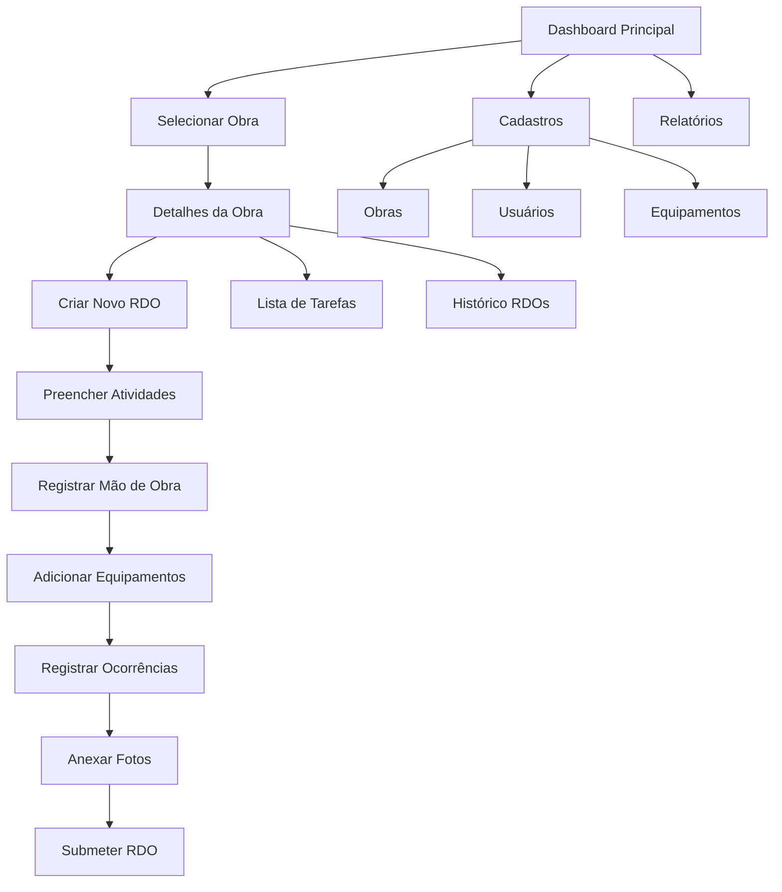

# Documento de Requisitos do Produto - App RDO Mobile

## 1. Visão Geral do Produto

O **RDO Mobile** é um aplicativo mobile-first para registro e acompanhamento diário de atividades em obras de construção civil. O app facilita o processo de criação de Relatórios Diários de Obra (RDO), permitindo que engenheiros, mestres de obra e gestores registrem atividades, mão de obra, equipamentos, condições climáticas e ocorrências de forma prática e organizada.

O produto visa substituir os relatórios em papel ou Excel por uma solução digital moderna, melhorando a comunicação entre canteiro de obra, escritório e clientes, proporcionando acompanhamento em tempo real do progresso das obras.

## 2. Funcionalidades Principais

### 2.1 Papéis de Usuário

| Papel | Método de Registro | Permissões Principais |
|-------|-------------------|----------------------|
| Mestre de Obra | Cadastro por convite | Criar e editar RDOs, registrar atividades, gerenciar mão de obra |
| Engenheiro | Cadastro por convite | Todas as permissões + aprovar RDOs, gerar relatórios |
| Gestor | Cadastro administrativo | Visualizar todas as obras, relatórios consolidados, gerenciar usuários |
| Cliente | Acesso por convite | Visualizar progresso da obra, relatórios aprovados |

### 2.2 Módulos Funcionais

Nosso aplicativo RDO Mobile consiste nas seguintes páginas principais:

1. **Dashboard Principal**: visão geral das obras, indicadores de progresso, últimas atividades
2. **Detalhes da Obra**: informações específicas da obra, histórico de RDOs, galeria de fotos
3. **Criar RDO**: formulário completo para registro diário de atividades
4. **Lista de Tarefas**: gerenciamento de atividades planejadas e executadas
5. **Cadastros**: formulários para obras, usuários, equipamentos e tipos de atividades
6. **Relatórios**: visualização e exportação de relatórios consolidados

### 2.3 Detalhes das Páginas

| Nome da Página | Nome do Módulo | Descrição da Funcionalidade |
|----------------|----------------|-----------------------------|
| Dashboard Principal | Visão Geral | Exibir cards das obras ativas, indicadores de progresso, últimos RDOs criados, notificações importantes |
| Dashboard Principal | Navegação Rápida | Acesso rápido para criar novo RDO, visualizar obras, acessar cadastros |
| Detalhes da Obra | Informações da Obra | Mostrar dados da obra, cronograma, responsáveis, localização |
| Detalhes da Obra | Histórico RDO | Listar RDOs anteriores com filtros por data, status, responsável |
| Detalhes da Obra | Galeria de Fotos | Visualizar fotos organizadas por data, com zoom e compartilhamento |
| Criar RDO | Informações Básicas | Campos para data, obra, responsável, condições climáticas |
| Criar RDO | Atividades Executadas | Adicionar atividades com descrição, localização, percentual concluído |
| Criar RDO | Mão de Obra | Registrar funcionários presentes, horas trabalhadas, função |
| Criar RDO | Equipamentos | Listar equipamentos utilizados, horas de operação, combustível |
| Criar RDO | Ocorrências | Registrar problemas, acidentes, atrasos com descrição detalhada |
| Criar RDO | Anexos | Adicionar fotos, documentos, assinaturas digitais |
| Lista de Tarefas | Tarefas Planejadas | Visualizar atividades programadas para o dia/semana |
| Lista de Tarefas | Controle de Execução | Marcar tarefas como iniciadas, em andamento, concluídas |
| Lista de Tarefas | Progresso Visual | Mostrar percentual de conclusão com barras de progresso |
| Cadastros | Cadastro de Obras | Formulário com dados da obra, endereço, responsáveis, cronograma |
| Cadastros | Cadastro de Usuários | Registrar funcionários com foto, função, permissões |
| Cadastros | Cadastro de Equipamentos | Listar equipamentos com especificações, manutenção, disponibilidade |
| Cadastros | Tipos de Atividades | Definir categorias de atividades padrão para seleção rápida |
| Relatórios | Relatórios Consolidados | Gerar relatórios por período, obra, tipo de atividade |
| Relatórios | Exportação | Exportar relatórios em PDF, Excel, compartilhar por email/WhatsApp |

## 3. Fluxo Principal

**Fluxo do Mestre de Obra:**
1. Acessa o dashboard e visualiza as obras sob sua responsabilidade
2. Seleciona uma obra específica para trabalhar
3. Cria um novo RDO diário preenchendo todas as seções obrigatórias
4. Adiciona fotos e registra ocorrências se necessário
5. Submete o RDO para aprovação do engenheiro
6. Acompanha o status das tarefas planejadas

**Fluxo do Engenheiro:**
1. Revisa RDOs pendentes de aprovação
2. Analisa o progresso geral das obras no dashboard
3. Gera relatórios consolidados para apresentação
4. Gerencia cadastros de equipamentos e atividades

## 4. Design da Interface do Usuário

### 4.1 Estilo de Design

- **Cores Primárias**: Azul #2563EB (confiança, profissionalismo), Laranja #F97316 (energia, ação)
- **Cores Secundárias**: Cinza #64748B (neutro), Verde #10B981 (sucesso), Vermelho #EF4444 (alertas)
- **Estilo dos Botões**: Neumorphism com bordas arredondadas (12px), sombras sutis, efeitos de pressão
- **Tipografia**: Inter (títulos 18-24px), Open Sans (corpo 14-16px), peso regular e semi-bold
- **Layout**: Cards com Glassmorphism, navegação bottom tab, espaçamentos de 16px/24px
- **Ícones**: Phosphor Icons com estilo outline, tamanho 24px para ações principais

### 4.2 Visão Geral do Design das Páginas

| Nome da Página | Nome do Módulo | Elementos da UI |
|----------------|----------------|----------------|
| Dashboard Principal | Cards de Obras | Cards com glassmorphism, gradiente sutil azul-roxo, sombra 0 4px 20px rgba(0,0,0,0.1), bordas arredondadas 16px |
| Dashboard Principal | Indicadores | Gráficos circulares com animação, cores verde/amarelo/vermelho para status, fonte Inter 14px |
| Dashboard Principal | Navegação | Bottom navigation com 5 tabs, ícones Phosphor, background blur, altura 80px |
| Criar RDO | Formulário | Floating labels com animação, campos com border-radius 12px, validação em tempo real com cores |
| Criar RDO | Seções Expansíveis | Accordion com ícones de seta, transição suave 300ms, background rgba(255,255,255,0.1) |
| Lista de Tarefas | Cards de Tarefa | Swipe actions (verde para concluir, vermelho para excluir), checkbox animado, progress bar |
| Lista de Tarefas | Filtros | Chips com seleção múltipla, cores Material Design 3, espaçamento 8px |
| Cadastros | Formulários | Stepper horizontal, campos agrupados em cards, botões flutuantes para ações |
| Relatórios | Gráficos | Charts.js com tema dark/light, cores consistentes, animações de entrada |

### 4.3 Responsividade

**Mobile-first** com adaptação para tablets. Layouts flexíveis usando CSS Grid e Flexbox, tamanhos em rem (base 16px), espaçamentos escaláveis (16px/24px/32px). Safe areas para dispositivos com notch/dynamic island. Suporte a orientação portrait e landscape para tablets.

**Gestos de Navegação:**
- Swipe para direita: voltar à tela anterior
- Swipe para baixo: pull-to-refresh nas listas
- Swipe horizontal em cards: ações rápidas (editar/excluir)
- Long press: menu contextual
- Pinch to zoom: galeria de fotos

**Dark Mode Automático:**
Detecção da preferência do sistema com toggle manual. Paleta adaptada: backgrounds #1F2937, cards #374151, textos #F9FAFB, acentos mantidos com ajuste de saturação.